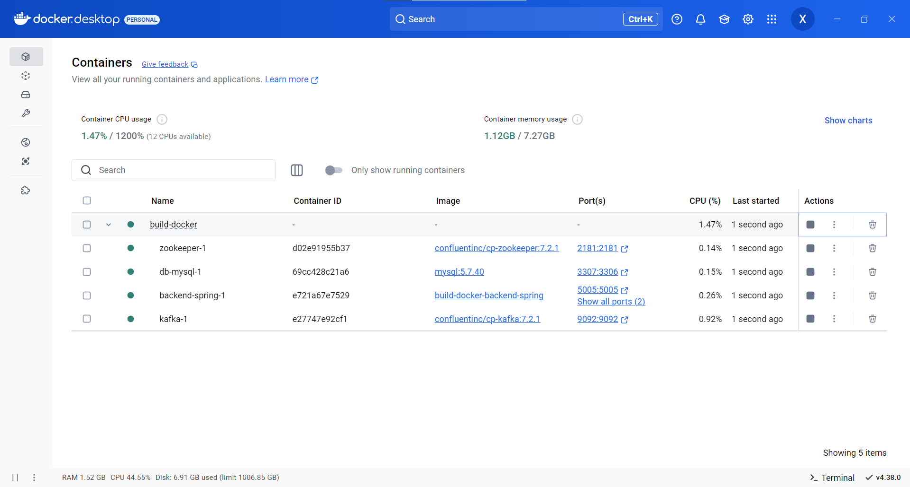

# Job Hunter

Dự án **Job Hunter** là một ứng dụng backend tập trung vào việc xử lý các API liên quan đến các chức năng chính của một nền tảng tuyển dụng việc làm , được xây dựng bằng **Spring Boot,  Kafka, Spring Security( JWT Authentication ), RESTful APIs, Spring Data JPA**

## Cài đặt

Clone dự án từ github

```bash
git clone https://github.com/hoango277/Job-Hunter.git
```

## Di chuyển vào thư mục docker

```bash
cd build-docker
```

## Chạy dự án

```docker
docker-compose up
```

### Kết quả





## Yêu cầu hệ thống
**Java**: phiên bản 17 trở lên

**MySQL**: phiên bản 5.7.40 trở lên

**Docker**: phiên bản 3.8 trở lên

